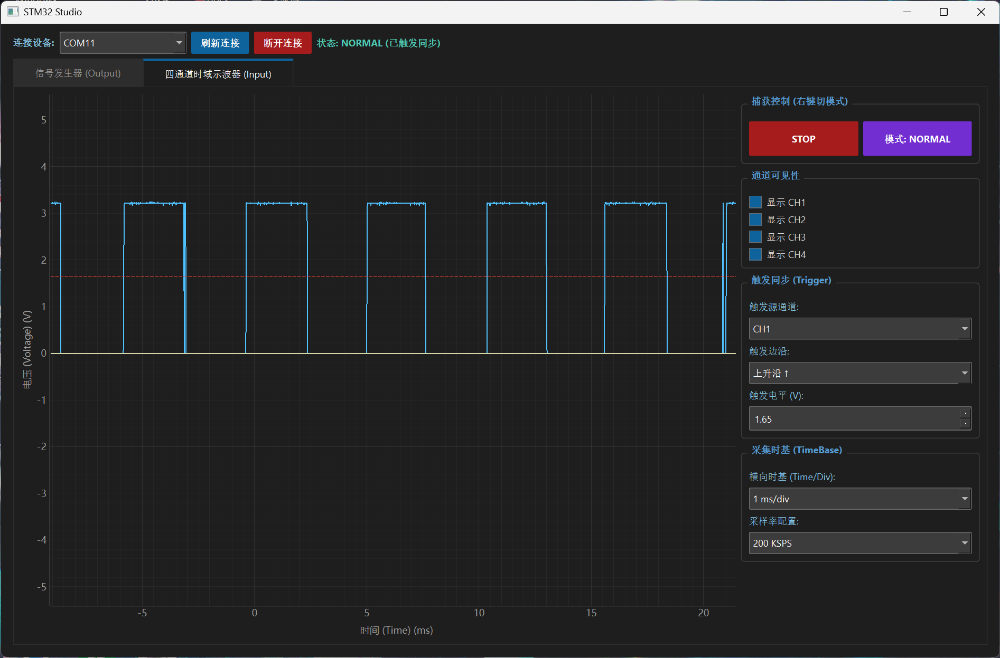
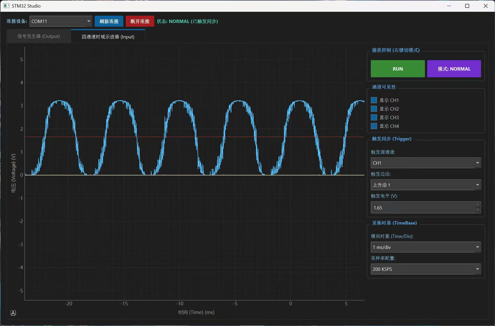
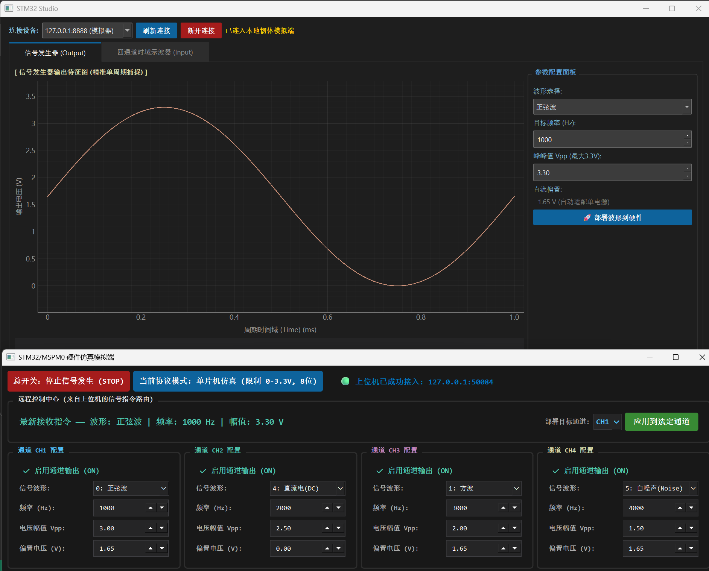
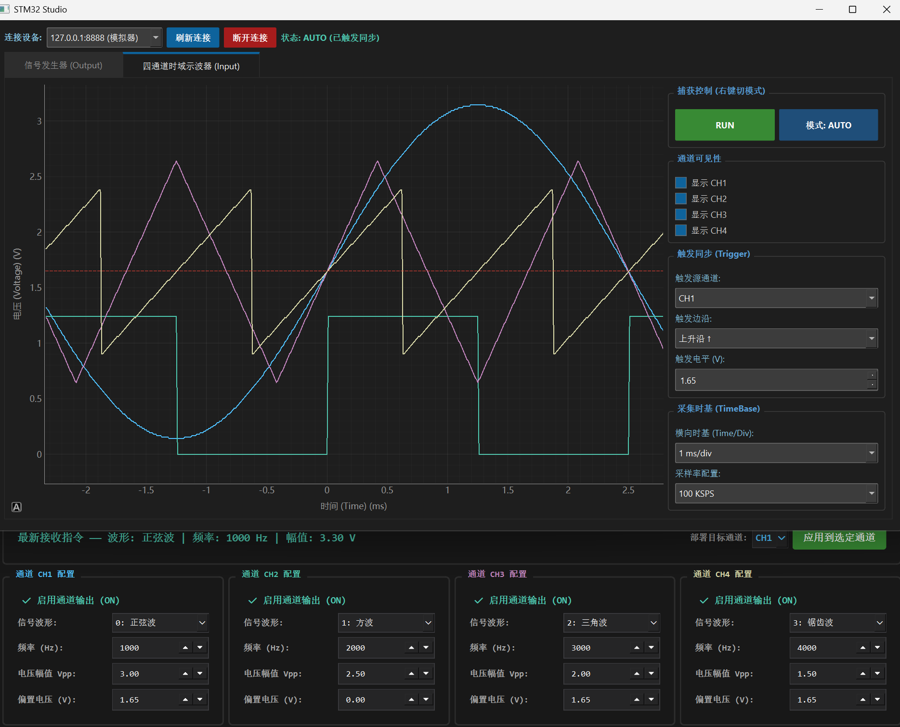

# Virtual Signal Instrumentation （虚拟信号源与示波器上下位机系统）
本项目是一款基于 STM32 单片机硬件、Python 虚拟模拟器与 PySide6+PyqtGraph 上位机开发的综合性虚拟仪器系统。 系统集成了四通道时域示波器与多波形讯号发生器，支持全双工高速序列埠通讯，具备高即时性、强抗干扰性与流畅的GUI互动体验。

## 📂 项目架构与模块说明
本仓库包含以下三大核心程序部分：

1.upper_computer.py（上位机）
基于 PySide6 （Qt for Python） 与 PyqtGraph 打造。
采用多线程异步通信架构，将「GUI 界面渲染」与「底层序列埠数据吞吐」彻底隔离，保障 4 通道数据并行高频刷新时不卡顿、不闪退。
整合专业示波器控制（AUTO/NORMAL/SINGLE 触发、时基/电位调节）与信号发生器配置面板。

2.stm32（STM32 单片机硬件固件）
基于STM32F103c8t6开发。
输入端：利用TIM定时器触发4通道ADC扫描采样，并透过DMA搬运至内存缓冲区，经由USBCDC（VCP虚拟序列端口）高速上传。
输出端：接收上位机控制影格，利用动态定时器配置计数周期，透过TIM+DMA输出高速 PWM 模拟 DAC 来实现高精度波形发生器。

3.单片机虚拟仿真器 （Simulator）
整合于上位机调试系统或独立仿真脚本中。
支持在无 STM32 实体硬件的情况下，利用 Python 的虚拟序列端口对抗（如 对接），模拟 STM32 底层寄存器级的数据流水与状态机响应，供纯软件验证和通讯协议除错。

## ✨ 核心功能特性

1.四通道时域示波器
支持 4 个独立通道同时采样，具备硬件级波形同步。
支持上升沿/下降沿触发，自定义触发电位，拥有专业级波形锁定能力。
精细优化底噪，解决了多通道 ADC 悬空时的串扰与天线效应。

2.多波形讯号发生器
支持输出四大标准波形：正弦波、方波、三角波、锯齿波。
动态可调参数：频率（1Hz - 100kHz）、峰峰值（Vpp 0 ~ 3.3V）。

3.高可靠全双工通讯链路
下行（控制）：严格的 状态机解包架构，解决断包、粘包问题。0x5A 0xA5
Windows 独占避坑机制：重构通讯对象生命周期，控制影格完全由背景 通讯线绪动态代理写入（），完美绕过Windows硬件底层独占引发的错误。

## 🛠️ 开发环境与依赖配置

1.上制机和模拟器环境（Python）
环境需求:P ython 3.8 或更高版本
快速安装依赖 ：
```
Bash
pip install PySide6 pyqtgraph numpy pyserial
```

2.单片机硬件环境（STM32）
主控芯片：STM32F103C8T6等
开发工具：STM32CubeMX + Keil uVision 5 / STM32CubeIDE
核心配置：USB_OTG_FS （CDC Device）、ADC1 （Multichannel Scan + DMA）、TIM （Base for Sampling & PWM Generation）

## 🚀 使用与操作指南

第一步：单片机韧体部署
打开所在的 Keil/CubeIDE 项目，编译源代码。main.c
将韧体刻录至 STM32 开发板中。
使用一条优质 USB 数据线（必须具备数据传输功能，勿用纯充电线）连接开发板的 USB 接口至电脑。

第二步：启动与连接（上位机 / 模拟器）
进入工程根目录，运行上制主机主程序 ：
```
Bash
python upper_computer.py
```
若使用实体单片机：在左上角序列埠下拉菜单中选择（例如）。COM11
<p align="center">
  
  <br>
  <sup>图 1：单片机输出方波</sup>
</p>

<p align="center">
  
  <br>
  <sup>图 2：单片机输出正弦波</sup>
</p>

若使用模拟器测试：启动虚拟序列端口软件对接（如启用 <-> ），上位机连接 即可进入模拟实时硬件环境。COM1,COM2,127.0.0.1:8888
点击 “连接串口” 按钮。
注：系统采用按需动态初始化机制。 开启软件时不会盲目占用通道，仅在点击连接的瞬间，背景通信执行绪才会诞生并安全绑定数据信号槽（data_received），彻底根治了激活崩溃。
<p align="center">
  
  <br>
  <sup>图 3：初始页面</sup>
</p>
第三步：虚拟仪器操作
示波器测试：点击 RUN 启动捕获。 切换不同通道（CH1~CH4）的显示，调整时基与电位。 测试时请务必确保未使用的 ADC 引脚接地（GND），以防悬空干扰。
波形部署下发：在信号发生器面板中，自由切换波形类型，拖动或精确输入频率（Hz）与幅值（Vpp），点击“ 部署波形到硬件”。 此时背景执行绪会动态接管通讯，直接下发 8 字节标准控制影格，单片机/模拟器将实时改变输出。
<p align="center">
  
  <br>
  <sup>图 4：软件模拟效果</sup>
</p>

## 🧩 通讯协议规范

为了保证动态控制的绝对准确，本项目上下位机通讯遵循以下高速影格结构。
上制机 -> 单片机/ 模拟器（控制命令格，固定 8 Bytes）

| 字节索引 | 字段名称 | 数据类型 | 说明 |
| :---: | :--- | :---: | :--- |
| `[0]` | 影格头 1 | `uint8_t` | 固定为 `0x5A` |
| `[1]` | 影格头 2 | `uint8_t` | 固定为 `0xA5` |
| `[2]` | 指令类型 | `uint8_t` | `0x01` 表示波形更新部署 |
| `[3]` | 波形选择 | `uint8_t` | `0`：正弦波，`1`：方波，`2`：三角波，`3`：鋸齒波 |
| `[4]` | 频率高位 | `uint8_t` | `(Freq >> 8) & 0xFF`（强制转换防止浮点位移溃散） |
| `[5]` | 频率低位 | `uint8_t` | `Freq & 0xFF` |
| `[6]` | 峰峰值幅值 | `uint8_t` | `int((Vpp / 3.3) * 255)`（对应 0~3.3V 底层硬件映射） |
| `[7]` | 校验和 | `uint8_t` | `(CMD + WAVE + FREQ_H + FREQ_L + VPP) & 0xFF`（低 8 位累加和） |
